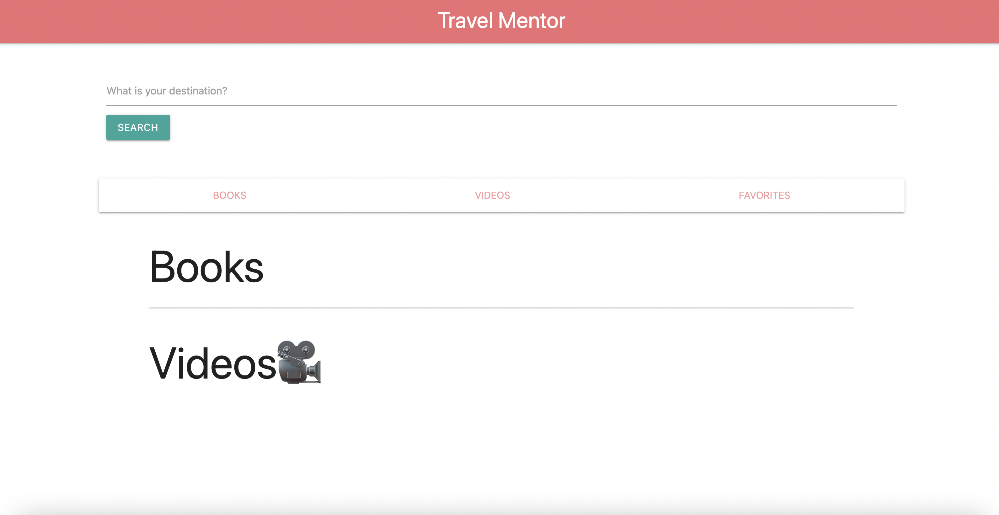
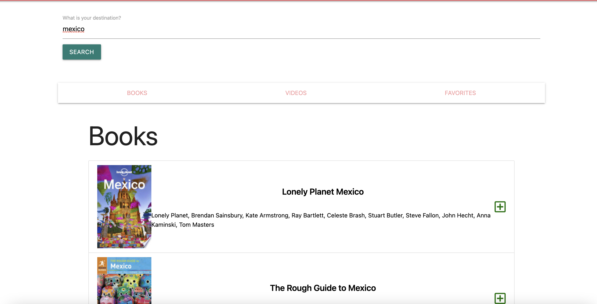
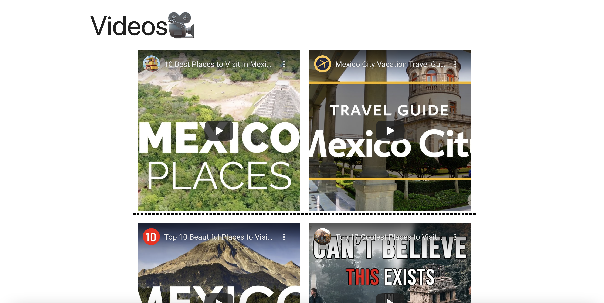

# Travel-Mentor

This project was created with the purpose of creating a platform where travelers can get important information about a destination they planned on visiting.  
on the next image, one can see what the initial page looks like. followed by an image of what the website look like after adding some input into the search bar.
  
 

# Usage
- Search for a specific destiantion on the search bar.
- scroll down the page to locate books/guides about the destination searched for.
- save any books/guides into the favorites list by clicking the "+" button next to it.
- have a safe and fun travel!

## Future Potential Development
Our team of developers would like to include a feature that allows for currency exchange rate information to display along with books and videos for the searched destination.
##  Deploye app

https://dylan-casanova.github.io/Travel-Mentor/ 

Click on the link above to go to the live website!

## contant Information
for any clarification or questions, contact any of the collaborators! email: dyylancasanova17@gmail.com  
for pull request:
GitHub: Dylan-Casanova
GitHub: mattyp1007

